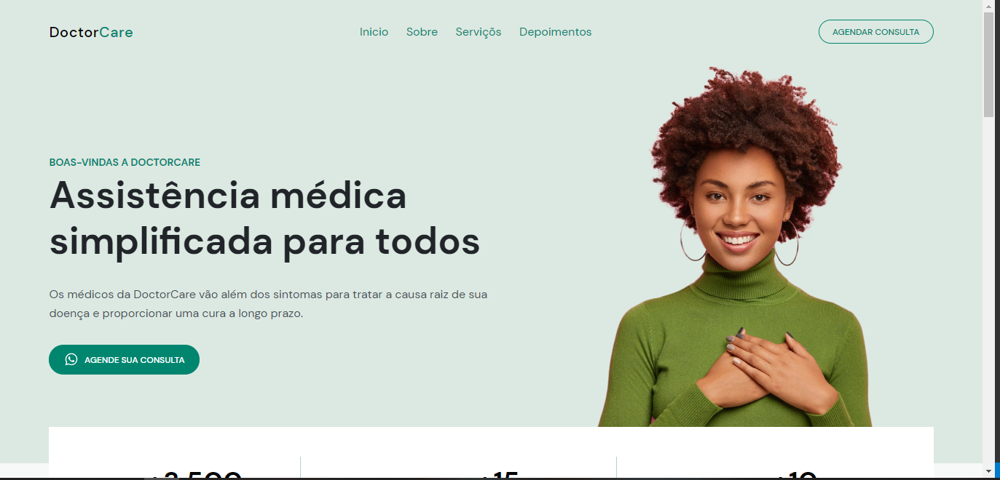

<h1 align="center">
   DoctorCare
</h1>

  <a href="https://willianstephano.github.io/DoctorCare/">
    <b>🚀Acesse o projeto 🚀</b>
  </a>
  
 <h5 align="center">
  Projeto em construção
</h5>

<h4 align="center">
  Projeto criado com o intuito de aprimorar meus conhecimentos nas tecnologias HTML, CSS e JS.
</h4>

<h6 align="center">
  O projeto teve como inspiração um projeto proposto pela Rocketseat no evento NLW return.
</h6>

## 📚 Seções
O projeto é composto por uma pagina que contem 4 seções principais:

- **Introdução:** Informações gerais sobre o site;
- **Card Informativo:** Principais dados acerca da historia da empresa;
- **Serviços:** Serviçoes ofercidos pela empresa;
- **Sobre nos:** Informações sobre a empresa;
- **Contato:** Seção de contato e endereço;

---

## 💼 Tecnologias utilizadas
Para o desenvolvimento deste projeto utilizei as seguintes tecnologias:

- HTML;
- CSS;
- JavaScript;
---

#### Autor
Willian Stephano
